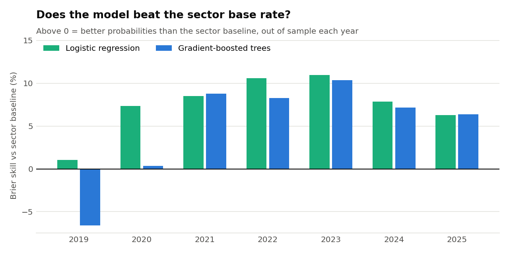
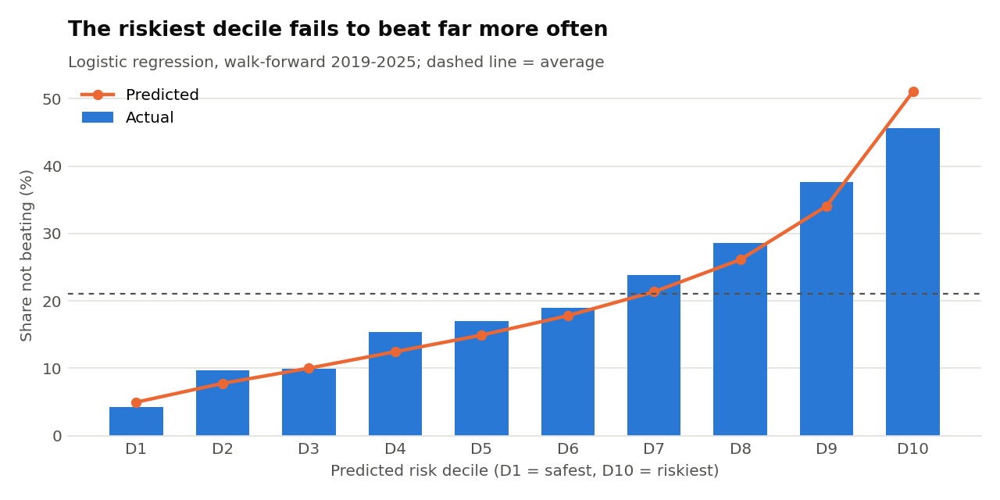
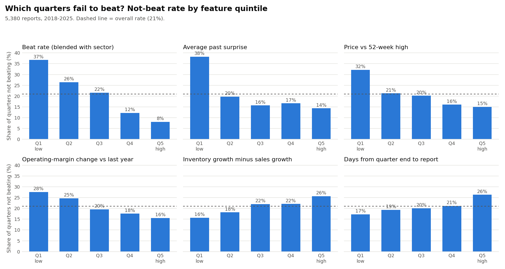

# Earnings Predictor

**Can we tell, before an earnings announcement, which quarters will fail to beat Wall Street's EPS estimate?**

Large US companies beat consensus 79% of the time, so a beat is the default. This project looks at the quarters that don't beat, where the market reacts hardest: in 2018–2025, stocks fell **3.2%** relative to the S&P 500 in the two days after a miss, against **+0.6%** after a beat.

The full project scope, hypotheses, success criteria and limitations are in **[CHARTER.md](CHARTER.md)**; every model input is defined in **[FEATURES.md](FEATURES.md)**.

## First model result

Walk-forward test, 2019–2025 (each year predicted using only earlier years), 4,750 reports:

| Model | Brier score | Skill vs sector base rate | ROC AUC | Not-beat rate in riskiest 10% |
|---|---|---|---|---|
| Sector base rate (the bar to beat) | 0.1635 | — | 0.57 | 21% |
| **Logistic regression** | **0.1513** | **+7.5%** | **0.71** | **46%** |
| Gradient-boosted trees | 0.1556 | +4.8% | 0.69 | 45% |

Logistic regression beats the sector base rate in **all 7** test years. The quarters it flags as riskiest fail to beat more than twice as often as average.





## Key findings so far

| | |
|---|---|
| Dataset | 5,380 earnings reports, 213 S&P 500 companies in 4 sectors, 2018–2025, point-in-time universe |
| Base rate | 79% of quarters beat consensus (87% in Information Technology) |
| Market reaction | Beat **+0.57%**, exactly in line **−2.01%**, miss **−3.20%** (2 days, vs S&P 500) — misses are punished ~5.6× harder than beats are rewarded |
| Meeting isn't enough | Beating by under 10% averages −0.19%; only beats above 10% are clearly rewarded (+1.60%) |
| Data quality | A cross-check caught the secondary vendor reporting GAAP instead of adjusted EPS, mixing stock-split bases, and using filing dates instead of announcement dates |

## Pipeline

| Step | Script | What it does |
|---|---|---|
| 1 | `probe_sources.py`, `check_eps_basis.py` | Tests the free data sources and whether EPS is adjusted or GAAP |
| 2 | `build_universe.py` | Point-in-time S&P 500 membership (who was in the index when), 4 sectors |
| 3 | `pull_data.py` | Earnings history and prices (yfinance), Alpha Vantage cross-check, SEC 8-K date check |
| 4 | `load_db.py` + `sql/` | Loads everything into PostgreSQL, runs data-quality checks and the exploration queries |
| 5 | `build_features.py` | Features from track record, estimates, prices and earnings season, with leakage tests |
| 6 | `pull_sec.py`, `build_fundamentals.py` | SEC financial statements (first-filed values only) → fundamental features |
| 7 | `train_model_v1.py` | Walk-forward baselines, logistic regression and gradient-boosted trees; results and charts in `reports/` |

Every feature uses only information available before the report date; automated leakage tests check this on each run.

## Running it

```bash
python3 -m venv .venv && source .venv/bin/activate
pip install yfinance pandas requests lxml "psycopg[binary]" scikit-learn matplotlib
export ALPHAVANTAGE_API_KEY=your_key
export SEC_USER_AGENT="Your Name your@email.com"
python build_universe.py
python pull_data.py
python load_db.py          # needs PostgreSQL running locally
python build_features.py
python pull_sec.py
python build_fundamentals.py
python train_model_v1.py
```

Downloaded data is not stored in this repository; the scripts recreate it.

## Status

- [x] Part 1 — scope, data sources, database, exploration
- [x] Part 2 — feature engineering: 39 leakage-tested features ([FEATURES.md](FEATURES.md))
- [ ] Part 3 — model and walk-forward evaluation (first version done; tuning and error analysis next)
- [ ] Dashboard and final report
